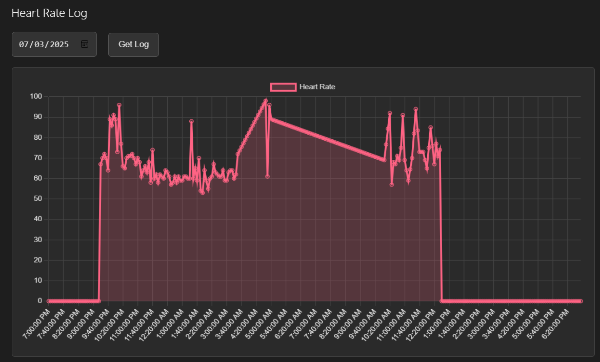
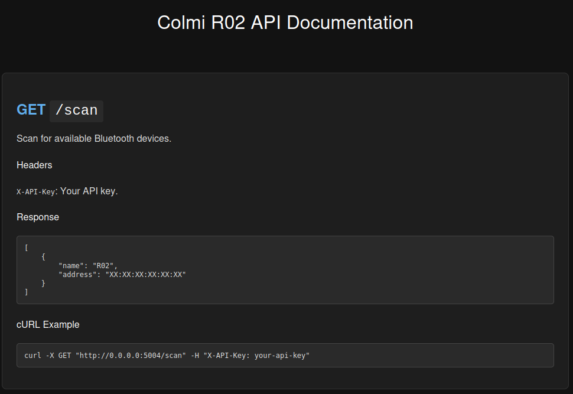

# Colmi R02 Web Application

This web application provides a user interface and a RESTful API to interact with the Colmi R02 smart ring.




## Disclaimer & Acknowledgements

This project is a GUI version of the original [colmi_r02_client](https://github.com/tahnok/colmi_r02_client) and was developed with the assistance of a Large Language Model (Gemini).

Please be aware that some bugs from the original CLI version may still persist. However, the application has been tested and works well with the **Colmi R02, R06, and R10** smart rings.

Due to the limited documentation of the ring's Bluetooth responses, some of the values displayed may not be 100% accurate.

A huge thank you to:

* [Puxtril/colmi-docs](https://github.com/Puxtril/colmi-docs) for their invaluable documentation efforts.
* [tahnok/colmi_r02_client](https://github.com/tahnok/colmi_r02_client) for the original Python client that this GUI is based on.

## Where to Buy

You can purchase the Colmi smart rings from [AliExpress](https://www.aliexpress.com/). One of the advantages of using this application is that you do not need to install the official app on your phone. So everything will be 100% local.

## Prerequisites

* Python 3.11
* Conda

## Installation

1. **Create a Conda environment:**
   
   ```bash
   conda create --name colmi python=3.11
   conda activate colmi
   ```
2. **Install the required dependencies:**
   
   ```bash
   pip install -r requirements.txt
   ```

## Configuration

1. **Set the API Key:**
   
   The application uses an API key for authentication. Create a `.env` file in the root of the project and add your API key:
   
   ```
   API_KEY=mysecretapikey
   ```
   
   You can change this key to any secret you prefer. You must then enter this key into the "API Key" field in the web interface to use the application.

## Running the Application

To start the web application, run the following command:

```bash
python web_app/main.py
```

The application will be available at `http://0.0.0.0:5004`.

## API

The web application provides a RESTful API to interact with the smart ring. All API endpoints require an API key to be sent in the `X-API-Key` header.

For detailed information about the API endpoints, please see the [API Documentation](docs/webapp_api_docs.html).



